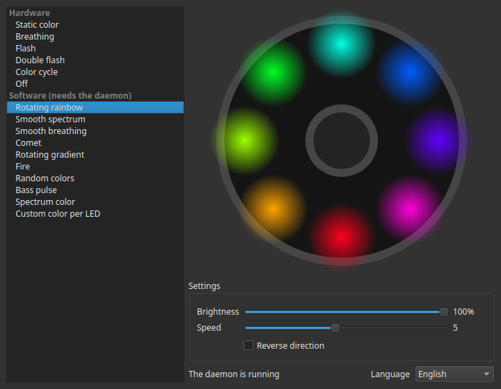

# cougar-rgb

Linux control for ARGB case lighting driven by the **Gigabyte RGB Fusion 2 USB** controller
(ITE `048d:5702`, found on many Gigabyte/AORUS motherboards). Built for a **Cougar Duoface Pro RGB**
case whose fan hub is switched to motherboard sync mode, but anything plugged into the `D_LED1`
ARGB header should work.



## Why

Existing Linux tools could switch modes, but the lighting stayed noticeably dimmer than under
Windows. The controller's effect brightness is a 0–255 byte, not a percentage; sending `100`
gives roughly 40 % brightness. This project always drives it at the full range and adds
per-LED software effects the firmware does not have.

## Features

- **Hardware effects** executed by the controller firmware: static, breathing, flash,
  double flash, color cycle, off. They keep running without any software.
- **Software per-LED effects** rendered by a small daemon: rotating rainbow, smooth spectrum,
  smooth breathing, comet, rotating gradient, fire, random colors, custom color per LED.
- **Music-reactive effects** from whatever is playing on the default output: bass pulse and
  spectrum color. Capture follows the default output when you switch devices, falls back to a
  chosen idle effect during silence, and supports a per-output light delay for Bluetooth
  headphones.
- **Daemon** (systemd user service) that applies the saved config on login, reinitializes the
  controller after suspend (logind `PrepareForSleep`) or USB reconnects, and picks up config
  changes live. It is a single native process: about 9 MB of RAM and ~1.5 % of one core while a
  music effect is running.
- **Native Qt 6 GUI** with a live fan preview that follows your desktop theme, and a **CLI** for
  scripting.
- **English and Russian** interface. The system language is used by default; pick another one in
  the GUI or with `cougar-rgb set --language en|ru|system`.

## Hardware

Tested on:

| Part | Model |
|---|---|
| Motherboard | Gigabyte Z790 GAMING X AX |
| Controller | ITE `048d:5702`, firmware `IT5701-GIGABYTE V3.5.5.0` |
| Case | Cougar Duoface Pro RGB (CGR-5AD1B-RGB), hub in motherboard sync mode |

What the code assumes about the setup (see `src/core/device.hpp` to adapt it):

- the lighting is on `D_LED1`: builtin effects use zone 5, per-LED data goes to register `0x58`,
  direct mode is bit `0x01` of command `0x32`;
- colors are sent in GRB order, both for effects and per-LED frames;
- 8 addressable LEDs; the Cougar hub mirrors them onto every fan.

The rest of the controller's zones are switched off when the daemon connects.

## Installation

Prebuilt packages are attached to each [release](https://github.com/simba77/cougar-rgb/releases).
They are built on Ubuntu 24.04 and need glibc 2.39+, `libsystemd`, `libpulse` (provided by
PipeWire or PulseAudio) and, for the GUI, Qt 6.4+.

### Debian, Ubuntu, KDE neon

```sh
sudo apt install ./cougar-rgb_*_amd64.deb
systemctl --user start cougar-rgb
```

The package installs the udev rule, the systemd user service (enabled for every user) and the
menu entry.

### Other distributions

Extract the `.tar.gz` and install the udev rule so your user can access the controller:

```sh
tar xzf cougar-rgb-*-linux-x86_64.tar.gz
cd cougar-rgb-*-linux-x86_64
sudo cp usr/lib/udev/rules.d/60-rgb-fusion2.rules /etc/udev/rules.d/
sudo udevadm control --reload && sudo udevadm trigger
usr/bin/cougar-rgb install      # systemd user service + menu entry pointing at these binaries
```

`cougar-rgb uninstall` removes the service and the menu entry.

### From source

Dependencies on Debian/Ubuntu:

```sh
sudo apt install cmake ninja-build pkg-config qt6-base-dev libsystemd-dev libpulse-dev \
    nlohmann-json3-dev catch2
```

```sh
cmake -S . -B build -G Ninja
cmake --build build
ctest --test-dir build
sudo cmake --install build          # or: cd build && cpack  → .deb and .tar.gz
```

Pass `-DCOUGAR_BUILD_GUI=OFF` to build only the CLI and daemon, without Qt.

## Usage

```sh
cougar-rgb gui                                   # graphical settings (same as cougar-rgb-gui)
cougar-rgb list                                  # available effects
cougar-rgb info                                  # controller and daemon status
cougar-rgb set static -c ff0040 -b 80            # hardware static color at 80 %
cougar-rgb set sw_rainbow -s 7 --reverse         # software rainbow, faster, counterclockwise
cougar-rgb set sw_bass_pulse --random --idle sw_fire
cougar-rgb set --delay 250                       # light delay for the current output, ms
cougar-rgb set --language en                     # interface language: system, en or ru
```

Settings are stored in `~/.config/cougar-rgb/config.json`. Hardware effects set without the
daemon are applied directly; software and music effects need the daemon.

## Development

The code is C++20: `src/core` holds the protocol, effects, config, audio analysis and engine
without any Qt dependency, `src/cli` the `cougar-rgb` CLI and daemon, `src/gui` the Qt Widgets
GUI. The tests (Catch2) check protocol packets byte-for-byte through a fake transport and feed
synthetic signals to the audio analyzer, so they need neither the controller nor an audio
server.

`COUGAR_RGB_SCREENSHOT=out.png cougar-rgb-gui` renders the window to a file and exits; with
`QT_QPA_PLATFORM=offscreen` this works without a display.

Versions up to 0.1.x were written in Python; see the `v0.1.1` tag.

## Credits

Protocol details and effect timings come from [OpenRGB](https://gitlab.com/CalcProgrammer1/OpenRGB)'s
Gigabyte RGB Fusion 2 USB driver.

## License

[GPL-3.0-or-later](LICENSE)
